  
  
  
  

---
 
### 💫 About Me
- 💼 Full Stack Developer at **Samodrei Llc**, Noida (May 2026 – Present)
- 🎓 MCA, Aligarh Muslim University (2023–2025) | B.Sc., Aligarh Muslim University (2020–2023)
- 🏭 Built and shipped production-grade web apps, including a **government-level healthcare platform** used in Uganda
- 📈 Improved SEO by migrating apps from CSR → SSR, hitting **top 3 Google rankings** for targeted keywords
- 🔭 Currently working on: **Scalable full-stack systems, CI/CD pipelines, and secure authentication**
- 🌱 Currently exploring: **Nest.js, AWS, Docker, and DevSecOps tooling (SonarQube, Snyk, Semgrep)**
- 👯 Looking to collaborate on: **Full Stack / SaaS projects**
- 💬 Ask me about: **MERN, Next.js, REST APIs, WebSockets, CI/CD, SEO Optimization**
- 📫 Reach me at: **mohd.ismaeel.dev@gmail.com**
- 😄 Pronouns: **He/Him**
---
 
### 🌐 Connect with me

  
  
  
  

---
 
### 💻 Tech Stack

  

---
 
### 🚀 Skills
| Category | Stack |
|---|---|
| **Languages** | JavaScript, Java |
| **Frontend** | React.js, Next.js, React Native, HTML, Tailwind CSS |
| **Backend** | Node.js, Express.js, Nest.js |
| **Databases** | MongoDB, MySQL, PostgreSQL |
| **Cloud & DevOps** | AWS, Docker, Cloudinary, GitHub Actions (CI/CD) |
| **Core Concepts** | REST APIs, WebSockets, SEO Optimization, DSA |
| **Code Quality/Security** | SonarQube, Snyk, Semgrep, ESLint |
 
---
 
### 💼 Experience
**Full Stack Developer** — Samodrei Llc, Noida `May 2026 – Present`
- Resolved package compatibility & dependency issues across the ASCThem application
- Improved backend reliability with proper error handling and code optimizations
- Built and maintained a GitHub Actions CI/CD pipeline for automated builds and quality checks
- Integrated SonarQube, Snyk, Semgrep, and ESLint for code quality & security
###
**Web Developer** — ZMQ Development, NSP, Delhi `Dec 2025 – Apr 2026`
- Developed a role-based resource management system used in production
- Reduced API response time by ~30% through query optimization
- Contributed to a large-scale healthcare platform adopted by government-level users (Uganda)
###
 **Web Developer Intern** — ZMQ Development, NSP, Delhi `Jul 2025 – Nov 2025`
- Optimized application performance and data handling in a large-scale healthcare system
- Collaborated on full-stack feature development and supported production deployments
---
 
### 📚 Featured Projects
| Project | Description | Tech Stack |
|---|---|---|
| **Smart Portfolio** | Full-stack portfolio with SSR (migrated from CSR), boosting SEO to a top-3 Google ranking. Includes an AI assistant (Groq API), admin dashboard, and Cloudinary media storage. | Next.js, MERN, Groq API |
| **ProjectVault** | Role-based academic project management platform with real-time feedback via WebSockets, cloud storage, and automated email notifications. | MERN, WebSockets, Brevo API |
| **[ProConnect]** | A LinkedIn-style professional networking platform with JWT auth, profiles, posts, comments, connections, and an automated resume-generation feature. | Next.js, MERN, JWT |
 
### 🔗 My Live Projects / Links
| Project | Details |
|---|---|
| **[Portfolio](https://www.mohdismaeel.me)** | My personal developer portfolio — showcases work experience, featured projects, blogs, education timeline, and live LeetCode/GeeksforGeeks coding stats. Built with Next.js (SSR) for top search-engine rankings, has a built-in terminal easter egg, and a contact form. |
| **[Resume](https://resume.mohdismaeel.me)** | A dynamic, fully-automated resume builder. Anyone can enter their own details (experience, education, skills, projects) and instantly generate a polished, professionally-formatted resume from a fixed template — no design work needed. |
| **[Code](https://code.mohdismaeel.me)** | A "code-to-image" snippet generator for sharing code on social media. Paste your code, choose the language (Java, JavaScript, Python), pick a theme (VS Code Dark, Dracula, Monokai), pick a window style (macOS/Windows), add a title/watermark, and download it as a shareable image. |
| **[AutoInsta](https://www.autoinsta.in)** | An AI-powered Instagram automation platform. Users sign in with Google, connect their Instagram business account via Meta's official OAuth API, and automate comment replies, DMs, and story engagement 24/7 — with built-in rate-limit protection to keep accounts safe, plus full activity logs. |
 
---
 
### 📊 GitHub Stats

  
  

  

> ✅ These cards are generated by our own script (`scripts/generate.js`) that pulls data directly from the GitHub API and runs daily via GitHub Actions — no third-party server involved, so they won't randomly go down.
 
---
 
### 🏆 GitHub Trophies

  

---
 
### 📈 Contribution Graph

  

---
 
### 📫 Let's Connect

  <a href="https://www.linkedin.com/in/mohd-ismaeel/">LinkedIn</a> ·
  <a href="https://leetcode.com/u/Mohd_Ismaeel/">LeetCode</a> ·
  <a href="https://www.geeksforgeeks.org/user/pmohd2/">GeeksforGeeks</a>

  

<!--
📌 SETUP NOTE (delete this comment once done — it won't show on your profile):
The stats/streak/trophy cards above are generated by OUR OWN script (scripts/generate.js),
not any third-party website or action. It calls the GitHub API directly and writes SVG files
into a "profile" folder in this repo — so nothing outside our control can ever break them.
To activate it (one-time, ~2 minutes):
1. Copy the "scripts" folder and ".github/workflows/update-cards.yml" file (provided
   separately) into this repo (github.com/ismaeelkhaleel/ismaeelkhaleel).
2. Commit and push.
3. Go to the "Actions" tab → select "Update profile cards" → click "Run workflow"
   to generate the cards for the first time.
4. It will create a "profile" folder with stats.svg, top-langs.svg, streak-stats.svg,
   and trophy.svg, and re-run automatically every day to keep them fresh.
No token setup needed — GitHub's built-in GITHUB_TOKEN is used automatically.
-->
